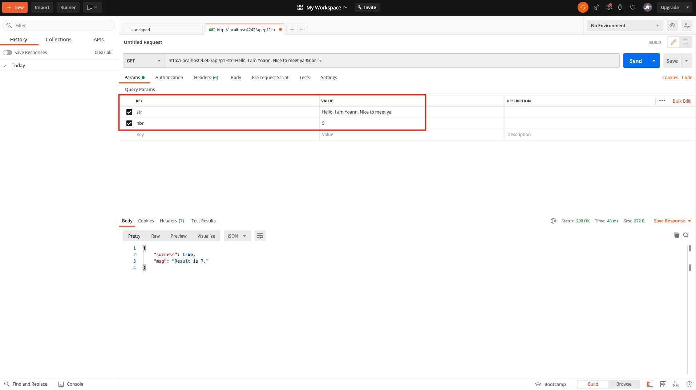
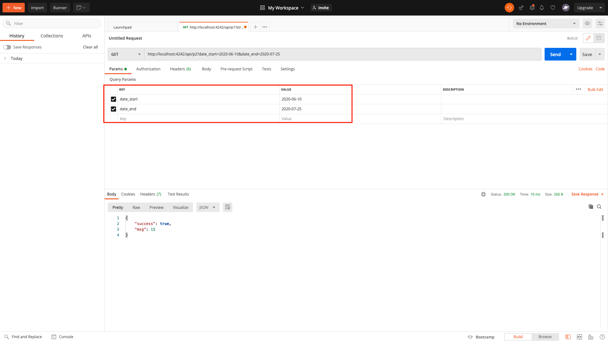

# REST API GET
This project is a simple Node.js REST API GET using Node.JS/EXpress.JS.

## Stack
* Back : Node JS / Express JS
* Test : Mocha / Chai

## Quick Start for local usage
### Install dependencies
```
cd server
npm i or yarn install
```

### Setup your environment variables
Go to file `.env.example`

### Run server
```
npm start
```

The console should show :
```
Started on server port <your-port>
```

## Test
Test scripts can be found in folder test : `server/test`.

First run the server :
```
npm start
OR
npm run dev
```

Then open a new terminal and run following command :
```
npm test
```

## Presentation
### Annexe1 </br>
Simple API GET application taking a string (str) and a number (nbr) url parameters as input && returning the result of the division of string length by number.
</br></br>
The number (nbr) must be between 0 and 20 inclusive.
</br></br>
Request URL : http://localhost:4242/api/p1 </br></br>


### Annexe2 </br>
Simple API GET application taking a start date (date_start) and an end date (date_end) url parameters as input && returning the total number of days between the 1st day of the month && the date_start, and the date_end && last
day of the month.
</br></br>
The start date (date_start) is required whereas the end date (date_end is optional).
</br></br>
Request URL : http://localhost:4242/api/p2 </br></br>

